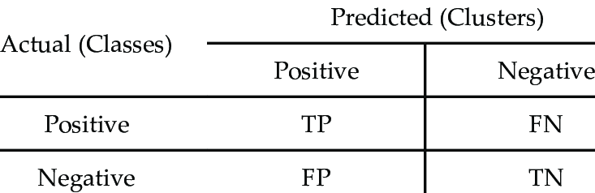

# Machine Learning (notatki)

Choć uczenie maszynowe nie należy do najprostszych tematów, podstawowa zasada działania sieci neuronowych, może być zawarta w jednym zdaniu:
*Dążymy do znalezienia **minimum funkcji kosztu**, czyli takich wartości **wag**, dla których funkcja kosztu przyjmuje najmniejszą wartość.*

### Zawartość repozytorium

- Sieć od podstaw
- Wprowadzenie do Keras
- Word Embeddings

## Sieć od podstaw

Choć współcześnie krajobraz uczenia maszynowego zdominowany jest przez wysokopoziomowe biblioteki, takie jak Tensorflow czy PyTorch, na samym początku warto poeksperymentować z sieciami pisanymi od podstaw.  Implementacja prostej sieci neuronowej od podstaw, pozwala poznać podstawowe koncepcje, takie jak propagacja wsteczna, funkcje aktywacji, ważenie synaptyczne itp.

Implementacje prostych sieci znajdują się w folderze: 

Opis poszczególnych etapów tworzenia sieci, eksperymentów i definiowanych funkcji.

### Przygotowanie danych

Pracę z danymi zaczynam od wizualnego przejrzenia zbioru. Określiłem, że znajdują się tam dwa rzędy wyjaśniające nazwę i typ prezentowanej zmiennej. Jest też sporo wartości pustych, najprawdopodobniej reprezentujących brak wartości.

Celem oczyszczenia zbioru, utworzyłem skrypt clean_data. W ramach operacji, ładuję nieoczyszczony zbiór basic.csv. Przeprowadzam podstawowe czyszczenie: usunięcie rzędów wyjaśniających oraz kolumny Z13; uzupełnienie braków danych zerami oraz profilaktyczne unormowanie typu danych w tabeli (to_numeric).
```python
import pandas as pd
import numpy as np

df = pd.read_csv('basic.csv')

df = df.drop([0, 1])
df = df.reset_index(drop=True)
df = df.drop('Z13', axis=1)
df = df.fillna(0)
df = df.apply(pd.to_numeric)
```
Następnym krokiem jest standaryzacja danych, tak aby wartości mieściły się w podobnym zakresie. Bez standaryzacji wysokie wartości mogłyby zdominować proces uczenia się sieci.

Do standaryzacji wybieram kolumny liczbowe (za kategoryczne uznaję wszystkie: 0-1). Korzystam z metody max-min, która przeskalowuje wartości w określonych kolumnach do standardowego zakresu od 0 do 1. Odbywa się to poprzez odjęcie wartości minimalnej w kolumnach i jej podzielenie przez zakres wartości tam znajdowanych.
```python
columns_to_standardize = ['Z11', 'Z14', 'Z15', 'Z16', 'Z17', 'Z18', 'Z19', 'Z20']
df[columns_to_standardize] = round((df[columns_to_standardize] - df[columns_to_standardize].min()) / (df[columns_to_standardize].max() - df[columns_to_standardize].min()), 6)
```
Zamieniam zmienną Z21 z numerycznej na kategoryczną, za pułap przyjmując medianę wartości liczby komentarzy. Dzięki temu można podzielić zbiór na dwie mniej więcej równe klasy.
```python
median = df['Z21'].median()
df['Z21'] = np.where(df['Z21'] > median, 1, 0)
```
Następnie sprawdzam, czy uzyskane klasy rzeczywiście są w miarę równoliczne.
```python
print(df['Z21'].value_counts())
```
Dla mediany wychodzą następujące liczebności klas:
0	341
1	301

Dla porównania, przy grupowaniu po średniej, klasy były znacząco nierówne:
0	488
1	154

Wartość mediany to 7. To znaczy, że 341 postów ma równo 7 lub mniej komentarzy. 301 postów ma więcej. Klasy nie mogą być dokładnie równe, gdyż wartości zachodziłyby na siebie. Zadaniem sieci będzie przewidzieć, czy przy danym poście liczba komentarzy jest większa niż mediana zbioru.

Pod koniec procesu przetwarzania, 50 ostatnich pozycji ze zbioru przeznaczam na zbiór testowy. Usuwam je ze zbioru treningowego.

test_df = df[-50:]
df = df[:-50]

Zapisuję zbiory.

df.to_csv('training.csv')
test_df.to_csv('test.csv')


### Budowa sieci neuronowej

Na początku przetestowałem architekturę opartą o kod z zajęć. Oczyściłem go z komentarzy, ponieważ był on omawiany na zajęciach. Jedyną modyfikacją była liczba inputów/wejść (11).

import pandas as pd
import numpy as np


class NeuralNetwork():


    def __init__(self):
        np.random.seed(1)
        self.synaptic_weights = 2 * np.random.random((11, 1)) - 1


    def sigmoid(self, x):
        return 1 / (1 + np.exp(-x))


    def sigmoid_derivative(self, x):
        return x * (1 - x)


    def train(self, training_inputs, training_outputs, training_iterations):


        for iteration in range(training_iterations):
            output = self.think(training_inputs)
            error = training_outputs - output
            adjustments = np.dot(training_inputs.T, error * self.sigmoid_derivative(output))
            self.synaptic_weights += adjustments


    def think(self, inputs):
        inputs = inputs.astype(float)
        output = self.sigmoid(np.dot(inputs, self.synaptic_weights))
        return output


### Trenowanie modelu

Tym co uległo zmianie, w relacji do skryptu z zajęć, jest sposób wprowadzania i walidacji danych. 

W deklaracji if __name__ == "__main__": zaczynam od zaimportowania danych z setu treningowego.

    df = pd.read_csv("training.csv")

Wyciągam zmienne Z9-Z20 jako zmienne objaśniające/predykcyjne i Z21 jako objaśnianą (labels).

    input_features = df[['Z9', 'Z10','Z11', 'Z12', 'Z14', 'Z15', 'Z16', 'Z17', 'Z18', 'Z19', 'Z20']]
    output_labels = df[['Z21']]

Tak jak w oryginalnym skrypcie, wartości z poszczególnych kolumn są przypisywane do wejść i wyjścia sieci.

    training_inputs = input_features.values
    training_outputs = output_labels.values

Inicjalizowany jest obiekt sieci i wywoływana jest metoda trenująca.

    neural_network = NeuralNetwork()
    neural_network.train(training_inputs, training_outputs, 11000)

Uzyskane wagi zapisuję w pliku weights.npy. Rozszerzenie .npy jest częścią biblioteki numpy.

np.save("weights.npy", neural_network.synaptic_weights)


Testowanie modelu

Przechodzę do walidacji modelu. Na początku inicjuję sieć, wczytując zapisane wagi.

    neural_network = NeuralNetwork()
    neural_network.synaptic_weights = np.load("weights.npy")

Analogicznie do zbioru treningowego przygotowuję zbiór testowy.

    test_df = pd.read_csv("test.csv")
    test_input_features = test_df[['Z9', 'Z10','Z11', 'Z12', 'Z14', 'Z15', 'Z16', 'Z17', 'Z18', 'Z19', 'Z20']]
    test_output_labels = test_df[['Z21']]
    test_inputs = test_input_features.values
    test_outputs = test_output_labels.values

Wartości testowe zapuszczane są do modelu i przypisane do zmiennej predictions. Jako że są to wartości zmiennoprzecinkowe, zamieniam je na binarne, wywołując metodę astype(). Wartości, które przekroczą próg 0.5 zliczane są jako 1 - pozostałe jako 0.

    predictions = neural_network.think(test_inputs)
    binary_predictions = (predictions > 0.5).astype(int)

Metryką, którą posłużę się do sprawdzenia modelu jest accuracy, czyli dokładność. Obliczam dokładność modelu wyciągając średnią z przypadków gdzie predykcja jest równa rzeczywistości. Następnie, wynik mnożony jest przez 100, aby otrzymać wartość w procentach.
Na przykład, jeśli accuracy wynosi 85, to oznacza, że model poprawnie sklasyfikował 85% próbek ze zbioru testowego.
    accuracy = np.mean(binary_predictions == test_outputs) * 100
    print("Mean accuracy:", accuracy)

Średnia dokładność modelu wyniosła 70%. Nie jest to wynik wybitny, ale całkiem przyzwoity jak na jedną warstwę.
Modyfikacja modelu

Dodawanie warstwy pośredniej

Pierwszą modyfikacją architektury, która mogłaby potencjalnie usprawnić jego dokładność, jest warstwa pośrednia, zwana też ukrytą. Dodanie takiej warstwy rozpoczynam od zadeklarowania nowego zestawu wag dla każdej z warstw. 

Warstwa wejściowa ma 11 neuronów przyjmujących input treningowy. Tych 11 neuronów połączonych jest z 5 neuronami w warstwie ukrytej, które z kolei łączą się z jednym neuronem wyjściowym. Liczba 5 neuronów jest wynikiem dalszych eksperymentów.

    def __init__(self):
        np.random.seed(1)
        self.synaptic_weights1 = 2 * np.random.random((11, 5)) - 1
        self.synaptic_weights2 = 2 * np.random.random((5, 1)) - 1

Modyfikacji ulega funkcja treningowa. Dodaję output warstwy ukrytej. Jego deklaracja jest taka sama jak outputu całej funkcji w wersji jednowarstwowej. Tam występuje jednak tylko w funkcji think. Tutaj musi być uzgadniany co iterację z warstwą ukrytą. Należy pamiętać, że output całej funkcji przyjmuje teraz output ukryty, a nie treningowy.

 def train(self, training_inputs, training_outputs, training_iterations):


        for iteration in range(training_iterations):
            hidden_output = self.sigmoid(np.dot(training_inputs, self.synaptic_weights1))
            output = self.sigmoid(np.dot(hidden_output, self.synaptic_weights2))

Tak jak wcześniej, błąd w warstwie wyjściowej jest obliczany na podstawie różnicy między oczekiwanymi wynikami a przewidywanymi wynikami. Następnie dostosowania/korekty (output_adjustments) są obliczane przy użyciu pochodnej funkcji aktywacji warstwy wyjściowej, tak samo jak w przypadku jednowarstwowej sieci. 

Na podstawie tych dostosowań oblicza się błąd w warstwie ukrytej przy użyciu macierzy wag między warstwą ukrytą a wyjściową. Mnożąc te korekty przez wagi synaptic_weights2, błąd z warstwy wyjściowej przenoszony jest z powrotem do warstwy ukrytej. Ten krok pozwala przypisać część błędu w warstwie wyjściowej do każdego neuronu w warstwie ukrytej.

            output_error = training_outputs - output
            output_adjustments = output_error * self.sigmoid_derivative(output)


            hidden_error = np.dot(output_adjustments, self.synaptic_weights2.T)
            hidden_adjustments = hidden_error * self.sigmoid_derivative(hidden_output)

Output ukryty deklarowany jest tak samo, jak wyjściowy:

    def think(self, inputs):
        inputs = inputs.astype(float)
        hidden_output = self.sigmoid(np.dot(inputs, self.synaptic_weights1))
        output = self.sigmoid(np.dot(hidden_output, self.synaptic_weights2))
        return output

Testowanie modelu odbywa się na tej samej zasadzie co poprzednio. Okazuje się jednak, że model traci na dokładności. Po kilku eksperymentach z liczbą neuronów pośrednich, najlepsze wyniki uzyskałem z 5 neuronami. Wyniki te są i tak gorsze niż w jednowarstwowej sieci, wynosząc jedynie 54%.

Najprawdopodobniej, dodatkowa warstwa wprowadza niepotrzebny poziom skomplikowania do prostej zależności, którą obserwuje się w danych. Ponadto, modele wielowarstwowe mogą wymagać większej ilości danych treningowych. Ewentualnie, można spróbować zdefiniować inną, prostszą funkcję aktywacji w warstwie ukrytej.

Zmiana funkcji aktywacji

Prostą funkcją aktywacji, którą można zastosować w warstwie ukrytej jest ReLU. Przyporządkowuje ona wartościom dodatnim ich wartość w sposób liniowy, a wartościom ujemnym wartość 0. Do definicji funkcji wykorzystuję metodę maximum z biblioteki numpy.

    def relu(self, x):
        return np.maximum(0, x)

Pochodna z ReLU to pochodna z X dla liczb dodatnich i pochodna z 0 dla liczb ujemnych. Jej wartości to więc odpowiednio 1 i 0.

    def relu_derivative(self, x):
        return np.where(x > 0, 1, 0)

Jedyną zmianą w stosunku do sieci dwuwarstwowej jest konieczność podmienienia funkcji sigmoid na ReLU we wszystkich miejscach, w których figurowała jako warstwa ukryta. Przykład poniżej:

hidden_output = self.sigmoid(np.dot(inputs, self.synaptic_weights1))

Zamieniam na:

hidden_output = self.relu(np.dot(training_inputs, self.synaptic_weights1))

Eksperymentując z liczbą neuronów pośrednich, przy 7 neuronach model osiągnął maksymalny wynik 64% dokładności. Lepiej, niż w przypadku dwóch warstw z aktywacją sigmoidalną, ale wciąż gorzej niż w przypadku jednowarstwowej sieci. Jak widać prostsze, nie znaczy gorsze.

Finalnie, najlepszym rozwiązaniem jest pozostanie przy oryginalnej architekturze jednowarstwowej sieci.


## Wprowadzenie do Keras

Na początku importowane są potrzebne biblioteki, w tym Keras - biblioteka do budowania sieci neuronowych, numpy - biblioteka do operacji na macierzach, matplotlib - biblioteka do rysowania wykresów.

```
import keras 
from keras.datasets import mnist 
import matplotlib.pyplot as plt 
from keras.utils import to_categorical
from keras.models import Sequential 
from keras.layers.core import Dense, Activation
import numpy as np
```

Następnie, ładowane są dane MNIST[^1] i dzielone na zbiory treningowy i testowy. Zbiór treningowy zawiera 60 000 obrazów cyfr, a zbiór testowy - 10 000 obrazów.

[^1]: MNIST to baza danych autorstwa Y. Le Cunn et al. zawierająca cyfry pisane odręcznie. Wchodzi w skład pakietu Keras.

```
(x_train, y_train), (x_test, y_test) = mnist.load_data()
```

Poniższe linie to standaryzacja danych, czyli normalizacja wartości pikseli do zakresu od 0 do 1. Celem normalizacji jest ułatwienie procesu uczenia modelu. Pozwala ona na szybsze zbieganie algorytmów optymalizacyjnych do minimum globalnego. Ponadto, w niektórych zbiorach danych, normalizacja jest wymagana celem zmniejszenia wpływu wartości odstających oraz umożliwienia porównywania danych różniących się skalą/jednostką/zakresem. 

```
x_train = x_train.astype('float32') 
x_test = x_test.astype('float32') 
x_train /= 255
x_test /= 255
```

Aby móc przetwarzać dane z obrazów 28x28 pikseli przez sieć typu DNN, należy przekształcić ją na jednowymiarową macierz o długości 784 pikseli.

```
x_train = x_train.reshape(60000, 784) 
x_test = x_test.reshape(10000, 784)
```

Kolejnym krokiem jest zakodowanie wartości cyfr na wektory binarne za pomocą funkcji `to_categorical` z biblioteki Keras. Dzięki temu możliwe jest przetwarzanie wyników przez sieć neuronową.

```
y_train = to_categorical(y_train, num_classes=10) 
y_test = to_categorical(y_test, num_classes=10)
```

W końcu przychodzi pora na stworzenie modelu: 

```
model = Sequential() 
model.add(Dense(10, activation='sigmoid', input_shape=(784,))) # pierwsza warstwa (wejściowa)
model.add(Dense(10, activation='softmax')) # druga warstwa
```

Tworzony jest model sieci neuronowej, składający się z dwóch warstw. Warstwy te są w pełni połączonymi warstwami neuronów, gdzie każdy neuron w warstwie jest połączony ze wszystkimi neuronami w poprzedniej warstwie. Pierwsza warstwa ma 10 neuronów i używa funkcji aktywacji sigmoid - druga warstwa również ma 10 neuronów i używa funkcji aktywacji softmax. Pierwsza warstwa jest warstwą wejściową, której rozmiar jest równy liczbie pikseli obrazów cyfr. 

Funkcja sigmoid przetwarza dane wejściowe (tj. piksele obrazów cyfr) na wartości z zakresu 0-1, które interpretujemy jako prawdopodobieństwo, że dany neuron reprezentuje daną cyfrę. Funkcja softmax natomiast normalizuje wyniki funkcji sigmoid w taki sposób, że suma wszystkich wartości wynosi 1. Dzięki temu wyniki tej funkcji możemy interpretować jako rozkład prawdopodobieństwa dla wszystkich klas.

Wzory funkcji aktywacji:

**Sigmoid** 

$\sigma(z) = \frac{1} {1 + e^{-z}}$

gdzie $z$ to wektor wejściowy - ważona suma wejść neuronu. Funkcja ta zwraca wartość bliską 0 dla bardzo dużych wartości ujemnych $x$, a wartość bliską 1 dla bardzo dużych wartości dodatnich $x$. Dla $x$ równego zero funkcja sigmoid zwraca wartość 0,5.

**Softmax**

$\sigma(x_i) = \frac{e^{z_i}}{\sum_{j=1}^{K} e^{z_j}} \quad \text{for } i=1,2,\dots,K$

gdzie $x$ to wektor wejściowy, a $K$ to liczba klas. Funkcja softmax normalizuje wartości wejściowe tak, że ich suma wynosi 1, co pozwala na interpretację wyników jako prawdopodobieństw przynależności do poszczególnych klas.

Alternatywnie, zamiast funkcji sigmoidalnej można użyć funkcji ReLU, która lepiej sprawdza się przy większej liczbie warstw:

$Relu(z) = max(0, z)$

funkcja zwraca wartość $z$ dla wartości pozytywnych $z$, a $0$ dla negatywnych.

Ostatnim krokiem jest kompilacja i tzw. *fitowanie* modelu:

```
model.compile(loss="categorical_crossentropy", optimizer="sgd", metrics = ['accuracy'])
model.fit(x_train, y_train, batch_size=100, epochs=5)
```

Jako funkcja straty ustawiona została `categorical_crossentropy`, optymalizator jako `sgd` (stochastic gradient descent) i metrykę jako `accuracy`. Dokładne znaczenie tych terminów wyjaśniam poniżej.

___

**Co to jest funkcja straty?** 

Najogólniej są to funkcje pozwalające porównać etykiety klas predykowanych i rzeczywistych. Przytaczana funkcja cross-entropi jest popularnym narzędziem stosowanym w problemach klasyfikacji wieloklasowej. 

**Co to jest optymalizator?**

Optymalizatory w sieciach neuronowych to algorytmy służące do aktualizacji wag sieci w trakcie procesu uczenia się, w celu minimalizacji funkcji kosztu. 

**Co to jest metryka?**

Metryki w uczeniu maszynowym to liczbowe wskaźniki służące do oceny jakości modelu uczącego się na podstawie zestawu danych. Metryki są używane do mierzenia, jak dobrze model dopasowuje się do danych treningowych oraz jak dobrze generalizuje na nowych, niewidzianych wcześniej danych testowych.

Zastosowana w ewaluacji modelu metryka `accuracy` oznacza procentową liczbę poprawnie sklasyfikowanych przykładów w zbiorze testowym:

$Accuracy = \frac{TP+TN}{TP+TN+FP+FN}$

gdzie: 



___
